Assignment 3
===================================


##  Setup

### Environment setup
You can use the python environment you've set up for past assignments, or re-install it with our `environment.yml` file:

```bash
conda env create -f environment.yml
conda activate l3d
```

If you do not have Anaconda, you can quickly download it [here](https://docs.conda.io/en/latest/miniconda.html), or via the command line in with:

```bash
wget https://repo.anaconda.com/miniconda/Miniconda3-latest-Linux-x86_64.sh
chmod +x Miniconda3-latest-Linux-x86_64.sh
bash Miniconda3-latest-Linux-x86_64.sh
```

### Data

Most of the data for this assignment is provided in the github repo under `data/`. One of the assets (materials scene) is large, you need to download the zip file from `https://drive.google.com/file/d/1v_0w1bx6m-SMZdqu3IFO71FEsu-VJJyb/view?usp=sharing` and unzip it into `data/` directory.

# A. Neural Volume Rendering

## 0. Transmittance Calculation (10 points)
Transmittance calculation is a core part for the implementation of volume rendering. Your first task is to compute the transmittance of a ray going through a non-homogeneous medium (shown in the image below).   
Please compute the transmittace in `transmittance_calculation/a3_transmittance.pdf` and submit the result on your assignment website. You can either hand write the result or edit the tex file and show a screenshot on your webpage, as long as it is readable by the TAs.

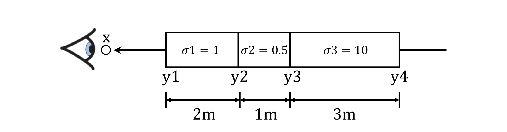

##  1. Differentiable Volume Rendering

In the emission-absorption (EA) model described in class, volumes are typically described by their *appearance* (e.g. emission) and *geometry* (absorption) at *every point* in 3D space. For part 1 of the assignment, you will implement a ***Differentiable Renderer*** for EA volumes, which you will use in parts 2 and 3. Differentiable renderers are extremely useful for 3D learning problems --- one reason is because they allow you to optimize scene parameters (i.e. perform inverse rendering) from image supervision only!

##  1.1. Familiarize yourself with the code structure

There are four major components of our differentiable volume rendering pipeline:

* ***The camera***: `pytorch3d.CameraBase`
* ***The scene***: `SDFVolume` in `implicit.py`
* ***The sampling routine***: `StratifiedSampler` in `sampler.py`
* ***The renderer***: `VolumeRenderer` in `renderer.py`

`StratifiedSampler` provides a method for sampling multiple points along a ray traveling through the scene (also known as *raymarching*). Together, a sampler and a renderer describe a rendering pipeline. Like traditional graphics pipelines, this rendering procedure is independent of the scene and camera.

The scene, sampler, and renderer are all packaged together under the `Model` class in `volume_rendering_main.py`. In particular the `Model`'s forward method invokes a `VolumeRenderer` instance with a sampling strategy and volume as input.

Also, take a look at the `RayBundle` class in `ray_utils.py`, which provides a convenient wrapper around several inputs to the volume rendering procedure per ray.

##  1.2. Outline of tasks

In order to perform rendering, you will implement the following routines:

1. **Ray sampling from cameras**: you will fill out methods in `ray_utils.py` to generate world space rays from a particular camera.
2. **Point sampling along rays**: you will fill out the `StratifiedSampler` class to generate sample points along each world space ray
3. **Rendering**: you will fill out the `VolumeRenderer` class to *evaluate* a volume function at each sample point along a ray, and aggregate these evaluations to perform rendering.

##  1.3. Ray sampling (5 points)

Take a look at the `render_images` function in `volume_rendering_main.py`. It loops through a set of cameras, generates rays for each pixel on a camera, and renders these rays using a `Model` instance.

### Implementation

Your first task is to implement:

1. `get_pixels_from_image` in `ray_utils.py` and
2. `get_rays_from_pixels` in `ray_utils.py`

which are used in `render_images`:

```python
xy_grid = get_pixels_from_image(image_size, camera) # TODO: implement in ray_utils.py
ray_bundle = get_rays_from_pixels(xy_grid, camera) # TODO: implement in ray_utils.py
```

The `get_pixels_from_image` method generates pixel coordinates, ranging from `[-1, 1]` for each pixel in an image. The `get_rays_from_pixels` method generates rays for each pixel, by mapping from a camera's *Normalized Device Coordinate (NDC) Space* into world space.

### Visualization

You can run the code for part 1 with:

```bash
# mkdir images (uncomment when running for the first time)
python volume_rendering_main.py --config-name=box
```

Once you have implemented these methods, verify that your output matches the TA output by visualizing both `xy_grid` and `rays` with the `vis_grid` and `vis_rays` functions in the `render_images` function in `main.py`. **By default, the above command will crash and return an error**. However, it should reach your visualization code before it does. The outputs of grid/ray visualization should look like this:

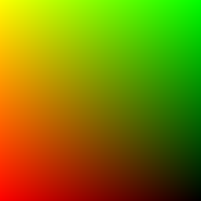    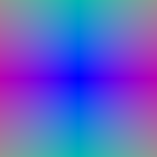

##  1.4. Point sampling (5 points)

### Implementation

Your next task is to fill out `StratifiedSampler` in `sampler.py`. Implement the forward method, which:

1. Generates a set of distances between `near` and `far` and
2. Uses these distances to sample points offset from ray origins (`RayBundle.origins`) along ray directions (`RayBundle.directions`).
3. Stores the distances and sample points in `RayBundle.sample_points` and `RayBundle.sample_lengths`

### Visualization

Once you have done this, use the `render_points` method in `render_functions.py` in order to visualize the point samples from the first camera. They should look like this:

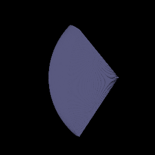

##  1.5. Volume rendering (20 points)

Finally, we can implement volume rendering! With the `configs/box.yaml` configuration, we provide you with an `SDFVolume` instance describing a box. You can check out the code for this function in `implicit.py`, which converts a signed distance function into a volume. If you want, you can even implement your own `SDFVolume` classes by creating new signed distance function class, and adding it to `sdf_dict` in `implicit.py`. Take a look at [this great web page](https://iquilezles.org/articles/distfunctions/) for formulas for some simple/complex SDFs.


### Implementation

You will implement

1. `VolumeRenderer._compute_weights` and
2. `VolumeRenderer._aggregate`.
3. You will also modify the `VolumeRenderer.forward` method to render a depth map in addition to color from a volume

From each volume evaluation you will get both volume density, and a color:

```python
# Call implicit function with sample points
implicit_output = implicit_fn(cur_ray_bundle)
density = implicit_output['density']
feature = implicit_output['feature']
```

You'll then use the following equation to render color along a ray:

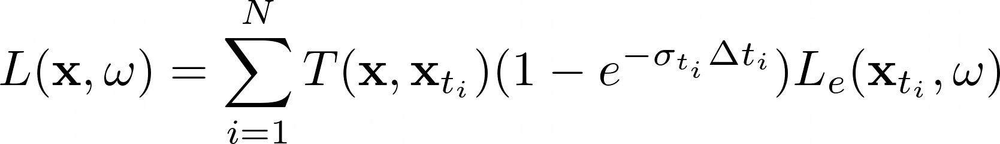

where `σ` is density, `Δt` is the length of current ray segment, and `L_e` is color:

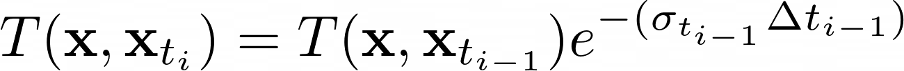

Compute the weights `T * (1 - exp(-σ * Δt))` in `VolumeRenderer._compute_weights`, and perform the summation in `VolumeRenderer._aggregate`. Note that for the first segment `T = 1`.

Use weights, and aggregation function to render *color* and *depth* (stored in `RayBundle.sample_lengths`). 

### Visualization

By default, your results will be written out to `images/part_1.gif`. Provide a visualization of the depth in your write-up. Note that the depth should be normalized by its maximum value.

 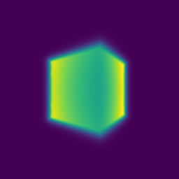


##  2. Optimizing a basic implicit volume

##  2.1. Random ray sampling (5 points)

Since you have now implemented a differentiable volume renderer, we can use it to optimize the parameters of a volume! We have provided a basic training loop in the `train` method in `volume_rendering_main.py`.

Depending on how many sample points we take for each ray, volume rendering can consume a lot of memory on the GPU (especially during the backward pass of gradient descent). Because of this, it usually makes sense to sample a subset of rays from a full image for each training iteration. In order to do this, implement the `get_random_pixels_from_image` method in `ray_utils.py`, invoked here:

```python
xy_grid = get_random_pixels_from_image(cfg.training.batch_size, image_size, camera) # TODO: implement in ray_utils.py
```

##  2.2. Loss and training (5 points)
Replace the loss in `train`

```python
loss = None
```

with mean squared error between the predicted colors and ground truth colors `rgb_gt`.

Once you've done this, you can run train a model with

```bash
python volume_rendering_main.py --config-name=train_box
```

This will optimize the position and side lengths of a box, given a few ground truth images with known camera poses (in the `data` folder). Report the center of the box, and the side lengths of the box after training, rounded to the nearest `1/100` decimal place.

##  2.3. Visualization

The code renders a spiral sequence of the optimized volume in `images/part_2.gif`. Compare this gif to the one below, and attach it in your write-up:

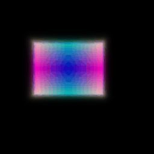


##  3. Optimizing a Neural Radiance Field (NeRF) (20 points)
In this part, you will implement an implicit volume as a Multi-Layer Perceptron (MLP) in the `NeuraRadianceField` class in `implicit.py`. This MLP should map 3D position to volume density and color. Specifically:

1. Your MLP should take in a `RayBundle` object in its forward method, and produce color and density for each sample point in the RayBundle.
2. You should also fill out the loss in `train_nerf` in the `volume_rendering_main.py` file.

You will then use this implicit volume to optimize a scene from a set of RGB images. We have implemented data loading, training, checkpointing for you, but this part will still require you to do a bit more legwork than for Parts 1 and 2. You will have to write the code for the MLP yourself --- feel free to reference the NeRF paper, though you should not directly copy code from an external repository.

## Implementation

Here are a few things to note:

1. For now, your NeRF MLP does not need to handle *view dependence*, and can solely depend on 3D position.
2. You should use the `ReLU` activation to map the first network output to density (to ensure that density is non-negative)
3. You should use the `Sigmoid` activation to map the remaining raw network outputs to color
4. You can use *Positional Encoding* of the input to the network to achieve higher quality. We provide an implementation of positional encoding in the `HarmonicEmbedding` class in `implicit.py`.

## Visualization
You can train a NeRF on the lego bulldozer dataset with

```bash
python volume_rendering_main.py --config-name=nerf_lego
```

This will create a NeRF with the `NeuralRadianceField` class in `implicit.py`, and use it as the `implicit_fn` in `VolumeRenderer`. It will also train a NeRF for 250 epochs on 128x128 images.

Feel free to modify the experimental settings in `configs/nerf_lego.yaml` --- though the current settings should allow you to train a NeRF on low-resolution inputs in a reasonable amount of time. After training, a spiral rendering will be written to `images/part_3.gif`. Report your results. It should look something like this:

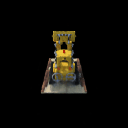

##  4. NeRF Extras (CHOOSE ONE! More than one is extra credit)

###  4.1 View Dependence (10 pts)

Add view dependence to your NeRF model! Specifically, make it so that emission can vary with viewing direction. You can read NeRF or other papers for how to do this effectively --- if you're not careful, your network may overfit to the training images. Discuss the trade-offs between increased view dependence and generalization quality. 

While you may use the lego scene to test your code, please employ the materials scene to show the results of your method on your webpage (experimental settings can be found in `nerf_materials.yaml` and `nerf_materials_highres.yaml`).

###  4.2 Coarse/Fine Sampling (10 pts)

NeRF employs two networks: a coarse network and a fine network. During the coarse pass, it uses the coarse network to get an estimate of geometry, and during fine pass uses these geometry estimates for better point sampling for the fine network. Implement this strategy and discuss trade-offs (speed / quality).

# B. Neural Surface Rendering

##  5. Sphere Tracing (10pts)

In this part you will implement sphere tracing for rendering an SDF, and use this implementation to render a simple torus. You will need to implement the `sphere_tracing` function in `renderer.py`. This function should return two outpus: (`points, mask`), where the `points` Tensor indicates the intersection point for each ray with the surface, and `masks` is a boolean Tensor indicating which rays intersected the surface.

You can run the code for part 5 with:
```bash
# mkdir images (uncomment when running for the first time)
python -m surface_rendering_main --config-name=torus_surface
```

This should save `part_5.gif` in the `images' folder. Please include this in your submission along with a short writeup describing your implementation.


##  6. Optimizing a Neural SDF (15pts)

In this part, you will implement an MLP architecture for a neural SDF, and train this neural SDF on point cloud data. You will do this by training the network to output a zero value at the observed points. To encourage the network to learn an SDF instead of an arbitrary function, we will use an 'eikonal' regularization which enforces the gradients of the predictions to behave in a certain way (search lecture slides for hints).

In this part you need to:

* **Implement a MLP to predict distance**: You should populate the `NeuralSurface` class in `implicit.py`. For this part, you need to define a MLP that helps you predict a distance for any input point. More concretely, you would need to define some MLP(s) in  `__init__` function, and use these to implement the `get_distance` function for this class. Hint: you can use a similar MLP to what you used to predict density in Part A, but remember that density and distance have different possible ranges!

* **Implement Eikonal Constraint as a Loss**: Define the `eikonal_loss` in `losses.py`.

After this, you should be able to train a NeuralSurface representation by:
```bash
python -m surface_rendering_main --config-name=points_surface
```

This should save save `part_6_input.gif` and `part_6.gif` in the `images` folder. The former visualizes the input point cloud used for training, and the latter shows your prediction which you should include on the webpage alongwith brief descriptions of your MLP and eikonal loss. You might need to tune hyperparameters (e.g. number of layers, epochs, weight of regularization, etc.) for good results.

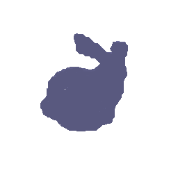

##  7. VolSDF (15 pts)

In this part, you will implement a function converting SDF -> volume density and extend the `NeuralSurface` class to predict color. 

* **Color Prediction**: Extend the the `NeuralSurface` class to predict per-point color. You may need to define a new MLP (a just a few new layers depending on how you implemented Q2). You should then implement the `get_color` and `get_distance_color` functions.

* **SDF to Density**: Read section 3.1 of the [VolSDF Paper](https://arxiv.org/pdf/2106.12052.pdf) and implement their formula converting signed distance to density in the `sdf_to_density` function in `renderer.py`. In your write-up, give an intuitive explanation of what the parameters `alpha` and `beta` are doing here. Also, answer the following questions:
1. How does high `beta` bias your learned SDF? What about low `beta`?
2. Would an SDF be easier to train with volume rendering and low `beta` or high `beta`? Why?
3. Would you be more likely to learn an accurate surface with high `beta` or low `beta`? Why?

After implementing these, train an SDF on the lego bulldozer model with

```bash
python -m surface_rendering_main --config-name=volsdf_surface
```

This will save `part_7_geometry.gif` and `part_7.gif`. Experiment with hyper-parameters to and attach your best results on your webpage. Comment on the settings you chose, and why they seem to work well.

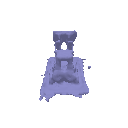 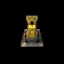


## 8. Neural Surface Extras (CHOOSE ONE! More than one is extra credit)

### 8.1. Render a Large Scene with Sphere Tracing (10 pts)
In Q5, you rendered a (lonely) Torus, but to the power of Sphere Tracing lies in the fact that it can render complex scenes efficiently. To observe this, try defining a ‘scene’ with many (> 20) primitives (e.g. Sphere, Torus, or another SDF from [this website](https://iquilezles.org/articles/distfunctions/) at different locations). See Lecture 2 for equations of what the ‘composed’ SDF of primitives is. You can then define a new class in `implicit.py` that instantiates a complex scene with many primitives, and modify the code for Q5 to render this scene instead of a simple torus.

### 8.2 Fewer Training Views (10 pts)
In Q7, we relied on 100 training views for a single scene. A benefit of using Surface representations, however, is that the geometry is better regularized and can in principle be inferred from fewer views. Experiment with using fewer training views (say 20) -- you can do this by changing [train_idx in data laoder](https://github.com/learning3d/assignment3/blob/main/dataset.py#L123) to use a smaller random subset of indices. You should also compare the VolSDF solution to a NeRF solution learned using similar views.

### 8.3 Alternate SDF to Density Conversions (10 pts)
In Q7, we used the equations from [VolSDF Paper](https://arxiv.org/pdf/2106.12052.pdf) to convert SDF to density. You should try and compare alternate ways of doing this e.g. the ‘naive’ solution from the [NeuS paper](https://arxiv.org/pdf/2106.10689.pdf), or any other ways that you might want to propose!
