Volume Rendering, NeRF, and 3D Gaussian Splatting
==================================================
Goals: In this assignment, you will set up a differentiable rendering pipeline and implement neural volume rendering techniques including NeRF, VolSDF, and 3D Gaussian Splatting.

## Table of Contents
 - [Setup](#setup)
 - [A. Neural Volume Rendering (60 points)](#a-neural-volume-rendering-60-points)
    - [1. Differentiable Volume Rendering](#1-differentiable-volume-rendering)
    - [2. Optimizing a Basic Implicit Volume](#2-optimizing-a-basic-implicit-volume)
    - [3. Optimizing a Neural Radiance Field (NeRF) (20 points)](#3-optimizing-a-neural-radiance-field-nerf-20-points)
    - [4. NeRF Extensions](#4-nerf-extensions)
 - [B. 3D Gaussian Splatting (60 points)](#b-3d-gaussian-splatting-60-points)
    - [5. 3D Gaussian Rasterization (35 points)](#5-3d-gaussian-rasterization-35-points)
    - [6. Training 3D Gaussian Representations (15 points)](#6-training-3d-gaussian-representations-15-points)
    - [7. Extensions (Choose at least one! More than one is extra credit)](#7-extensions-choose-at-least-one-more-than-one-is-extra-credit)
       - [7.1 Rendering Using Spherical Harmonics (10 points)](#71-rendering-using-spherical-harmonics-10-points)
       - [7.2 Training On a Harder Scene (10 points)](#72-training-on-a-harder-scene-10-points)


##  Setup

### Environment Setup
You can use the python environment you've set up for past assignments, but if you're starting fresh, please follow the instructions from Assignment 1 to get an environment with `torch` and `pytorch3d` up and running. This assignment needs a few additional packages, that can be installed with - 
```bash
pip install -r requirements.txt
```

### Data

Most of the data for this assignment is provided under `nerf/data` and `GS/data`. The materials scene is large, so you can download and unzip it as follows -
```bash
sudo apt install git-lfs
git lfs install

git clone https://huggingface.co/datasets/learning3dvision/nerf_materials
cd nerf_materials
unzip materials.zip -d ../GS/data
```
# A. Neural Volume Rendering (60 points)

Run all commands in this section from the `nerf` folder.

##  1. Differentiable Volume Rendering

In the emission-absorption (EA) model described in class, volumes are typically described by their *appearance* (e.g. emission) and *geometry* (absorption) at *every point* in 3D space. For part 1 of the assignment, you will implement a ***Differentiable Renderer*** for EA volumes, which you will use in parts 2 and 3. Differentiable renderers are extremely useful for 3D learning problems --- one reason is because they allow you to optimize scene parameters (i.e. perform inverse rendering) from image supervision only!

##  1.1. Familiarize yourself with the code structure

There are four major components of our differentiable volume rendering pipeline:

* ***The camera***: `pytorch3d.CameraBase`
* ***The scene***: `SDFVolume` in `implicit.py`
* ***The sampling routine***: `StratifiedRaysampler` in `sampler.py`
* ***The renderer***: `VolumeRenderer` in `renderer.py`

`StratifiedRaysampler` provides a method for sampling multiple points along a ray traveling through the scene (also known as *raymarching*). Together, a sampler and a renderer describe a rendering pipeline. Like traditional graphics pipelines, this rendering procedure is independent of the scene and camera.

The scene, sampler, and renderer are all packaged together under the `Model` class in `volume_rendering_main.py`. In particular the `Model`'s forward method invokes a `VolumeRenderer` instance with a sampling strategy and volume as input.

Also, take a look at the `RayBundle` class in `ray_utils.py`, which provides a convenient wrapper around several inputs to the volume rendering procedure per ray.

##  1.2. Outline of tasks

In order to perform rendering, you will implement the following routines:

1. **Ray sampling from cameras**: you will fill out methods in `ray_utils.py` to generate world space rays from a particular camera.
2. **Point sampling along rays**: you will fill out the `StratifiedRaysampler` class to generate sample points along each world space ray
3. **Rendering**: you will fill out the `VolumeRenderer` class to *evaluate* a volume function at each sample point along a ray, and aggregate these evaluations to perform rendering.

##  1.3. Ray sampling (5 points)

Take a look at the `render_images` function in `volume_rendering_main.py`. It loops through a set of cameras, generates rays for each pixel on a camera, and renders these rays using a `Model` instance.

### Implementation

Your first task is to implement:

1. `get_pixels_from_image` in `ray_utils.py` and
2. `get_rays_from_pixels` in `ray_utils.py`

which are used in `render_images`:

```python
xy_grid = get_pixels_from_image(image_size, camera) # TODO: implement in ray_utils.py
ray_bundle = get_rays_from_pixels(xy_grid, camera) # TODO: implement in ray_utils.py
```

The `get_pixels_from_image` method generates pixel coordinates, ranging from `[-1, 1]` for each pixel in an image. The `get_rays_from_pixels` method generates rays for each pixel, by mapping from a camera's *Normalized Device Coordinate (NDC) Space* into world space.

### Visualization

You can run the code for part 1 with:

```bash
# mkdir images (uncomment when running for the first time)
python volume_rendering_main.py --config-name=box
```

Once you have implemented these methods, verify that your output matches the TA output by visualizing both `xy_grid` and `rays` with the `vis_grid` and `vis_rays` functions in the `render_images` function in `volume_rendering_main.py`. **By default, the above command will crash and return an error**. However, it should reach your visualization code before it does. The outputs of grid/ray visualization should look like this:

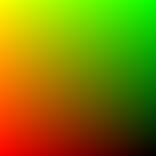    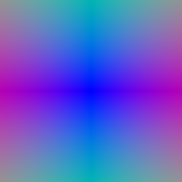

##  1.4. Point sampling (5 points)

### Implementation

Your next task is to fill out `StratifiedRaysampler` in `sampler.py`. Implement the forward method, which:

1. Generates a set of distances between `near` and `far` and
2. Uses these distances to sample points offset from ray origins (`RayBundle.origins`) along ray directions (`RayBundle.directions`).
3. Stores the distances and sample points in `RayBundle.sample_points` and `RayBundle.sample_lengths`

### Visualization

Once you have done this, use the `render_points` method in `render_functions.py` in order to visualize the point samples from the first camera. They should look like this:

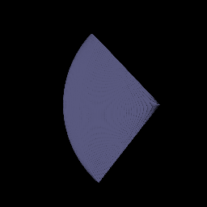

##  1.5. Volume rendering (20 points)

Finally, we can implement volume rendering! With the `configs/box.yaml` configuration, we provide you with an `SDFVolume` instance describing a box. You can check out the code for this function in `implicit.py`, which converts a signed distance function into a volume. If you want, you can even implement your own `SDFVolume` classes by creating new signed distance function class, and adding it to `sdf_dict` in `implicit.py`. Take a look at [this great web page](https://iquilezles.org/articles/distfunctions/) for formulas for some simple/complex SDFs.


### Implementation

You will implement

1. `VolumeRenderer._compute_weights` and
2. `VolumeRenderer._aggregate`.
3. You will also modify the `VolumeRenderer.forward` method to render a depth map in addition to color from a volume

From each volume evaluation you will get both volume density, and a color:

```python
# Call implicit function with sample points
implicit_output = implicit_fn(cur_ray_bundle)
density = implicit_output['density']
feature = implicit_output['feature']
```

You'll then use the following equation to render color along a ray:

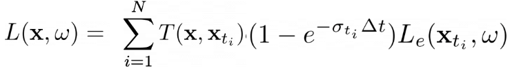

where `σ` is density, `Δt` is the length of current ray segment, and `L_e` is color:

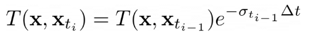

Compute the weights `T * (1 - exp(-σ * Δt))` in `VolumeRenderer._compute_weights`, and perform the summation in `VolumeRenderer._aggregate`. Note that for the first segment `T = 1`.

Use weights, and aggregation function to render *color* and *depth* (stored in `RayBundle.sample_lengths`). 

### Visualization

By default, your results will be written out to `images/part_1.gif`. Provide a visualization of the depth in your write-up. Note that the depth should be normalized by its maximum value.

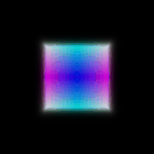 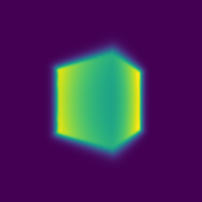


##  2. Optimizing a basic implicit volume

##  2.1. Random ray sampling (5 points)

Since you have now implemented a differentiable volume renderer, we can use it to optimize the parameters of a volume! We have provided a basic training loop in the `train` method in `volume_rendering_main.py`.

Depending on how many sample points we take for each ray, volume rendering can consume a lot of memory on the GPU (especially during the backward pass of gradient descent). Because of this, it usually makes sense to sample a subset of rays from a full image for each training iteration. In order to do this, implement the `get_random_pixels_from_image` method in `ray_utils.py`, invoked here:

```python
xy_grid = get_random_pixels_from_image(cfg.training.batch_size, image_size, camera) # TODO: implement in ray_utils.py
```

##  2.2. Loss and training (5 points)
Replace the loss in `train`

```python
loss = None
```

with mean squared error between the predicted colors and ground truth colors `rgb_gt`.

Once you've done this, you can run train a model with

```bash
python volume_rendering_main.py --config-name=train_box
```

This will optimize the position and side lengths of a box, given a few ground truth images with known camera poses (in the `data` folder). Report the center of the box, and the side lengths of the box after training, rounded to the nearest `1/100` decimal place.

##  2.3. Visualization

The code renders a spiral sequence of the optimized volume in `images/part_2.gif`. Compare this gif to the one below, and attach it in your write-up:

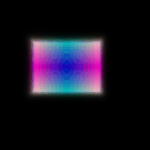


##  3. Optimizing a Neural Radiance Field (NeRF) (20 points)
In this part, you will implement an implicit volume as a Multi-Layer Perceptron (MLP) in the `NeuralRadianceField` class in `implicit.py`. This MLP should map 3D position to volume density and color. Specifically:

1. Your MLP should take in a `RayBundle` object in its forward method, and produce color and density for each sample point in the RayBundle.
2. You should also fill out the loss in `train_nerf` in the `volume_rendering_main.py` file.

You will then use this implicit volume to optimize a scene from a set of RGB images. We have implemented data loading, training, checkpointing for you, but this part will still require you to do a bit more legwork than for Parts 1 and 2. You will have to write the code for the MLP yourself --- feel free to reference the NeRF paper, though you should not directly copy code from an external repository.

## Implementation

Here are a few things to note:

1. For now, your NeRF MLP does not need to handle *view dependence*, and can solely depend on 3D position.
2. You should use the `ReLU` activation to map the first network output to density (to ensure that density is non-negative)
3. You should use the `Sigmoid` activation to map the remaining raw network outputs to color
4. You can use *Positional Encoding* of the input to the network to achieve higher quality. We provide an implementation of positional encoding in the `HarmonicEmbedding` class in `implicit.py`.

## Visualization
You can train a NeRF on the lego bulldozer dataset with

```bash
python volume_rendering_main.py --config-name=nerf_lego
```

This will create a NeRF with the `NeuralRadianceField` class in `implicit.py`, and use it as the `implicit_fn` in `VolumeRenderer`. It will also train a NeRF for 250 epochs on 128x128 images.

Feel free to modify the experimental settings in `configs/nerf_lego.yaml` --- though the current settings should allow you to train a NeRF on low-resolution inputs in a reasonable amount of time. After training, a spiral rendering will be written to `images/part_3.gif`. Report your results. It should look something like this:

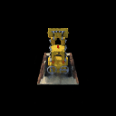

##  4. NeRF Extras (CHOOSE ONE! More than one is extra credit)

###  4.1 View Dependence (10 bonus points)

Add view dependence to your NeRF model! Specifically, make it so that emission can vary with viewing direction. You can read NeRF or other papers for how to do this effectively --- if you're not careful, your network may overfit to the training images. Discuss the trade-offs between increased view dependence and generalization quality. 

While you may use the lego scene to test your code, please employ the materials scene to show the results of your method on your webpage (experimental settings can be found in `nerf_materials.yaml` and `nerf_materials_highres.yaml`).

If you haven't done so already, make sure to download and unzip the `nerf_materials` dataset as described in the setup section.

###  4.2 Coarse/Fine Sampling (10 bonus points)

NeRF employs two networks: a coarse network and a fine network. During the coarse pass, it uses the coarse network to get an estimate of geometry, and during fine pass uses these geometry estimates for better point sampling for the fine network. Implement this strategy and discuss trade-offs (speed / quality).

###  4.3 VolSDF (10 bonus points)

In this part, you will implement a function converting SDF -> volume density and extend the `NeuralSurface` class to predict color. 

* **Implement a MLP to predict distance**: You should populate the `NeuralSurface` class in `implicit.py`. For this part, you need to define a MLP that helps you predict a distance for any input point. More concretely, you would need to define some MLP(s) in  `__init__` function, and use these to implement the `get_distance` function for this class. Hint: you can use a similar MLP to what you used to predict density in Part A, but remember that density and distance have different possible ranges!

* **Implement Eikonal Constraint as a Loss**: Define the `eikonal_loss` in `losses.py`.

* **Color Prediction**: Extend the `NeuralSurface` class to predict per-point color. You may need to define a new MLP (just a few new layers, depending on how you implemented the earlier neural field). You should then implement the `get_color` and `get_distance_color` functions.

* **SDF to Density**: Read section 3.1 of the [VolSDF Paper](https://arxiv.org/pdf/2106.12052.pdf) and implement their formula converting signed distance to density in the `sdf_to_density` function in `renderer.py`. In your write-up, give an intuitive explanation of what the parameters `alpha` and `beta` are doing here. Also, answer the following questions:
1. How does high `beta` bias your learned SDF? What about low `beta`?
2. Would an SDF be easier to train with volume rendering and low `beta` or high `beta`? Why?
3. Would you be more likely to learn an accurate surface with high `beta` or low `beta`? Why?

After implementing these, train an SDF on the lego bulldozer model with

```bash
python -m volume_rendering_main --config-name=volsdf_surface
```

This will save `part_4_3_geometry.gif` and `part_4_3.gif`. Experiment with hyper-parameters to and attach your best results on your webpage. Comment on the settings you chose, and why they seem to work well.

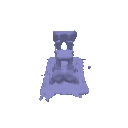 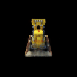


---

## B. 3D Gaussian Splatting (60 points)

In the first part of this assignment, we will explore 3D Gaussian Splatting by building a simplified version of the 3D Gaussian rasterization pipeline introduced by the [original paper](https://repo-sam.inria.fr/fungraph/3d-gaussian-splatting/3d_gaussian_splatting_low.pdf). Once we create the rasterizer, we will first use it to render pre-trained 3D Gaussians provided by the authors of the original paper. Then, we will create training code which leverages the renderer to optimize 3D Gaussians to represent custom scenes.

Notes:

- Run all code for this section from the `GS` folder.
- Search for `"### YOUR CODE HERE ###"` for areas where code should be written.
- Please remember to follow the deliverables specified in the **Submission** section in each question.

## 5. 3D Gaussian Rasterization (35 points)

In this section, we will implement a 3D Gaussian rasterization pipeline in PyTorch. The official implementation uses custom CUDA code and several optimizations to make the rendering very fast. For simplicity, our implementation avoids many of the tricks and optimizations used by the official implementation and hence would be much slower. Additionally, instead of using all the spherical harmonic coefficients to model view dependent effects, we will only use the view independent compoenents.

Inspite of these limitations, once you complete this section successfully, you will find that our simplified 3D Gaussian rasterizer can still produce renderings of pre-trained 3D Gaussians that were trained using the original codebase reaonsably well!

For this section, you will have to complete the code in the files `model.py` and `render.py`. The file `model.py` contains code that manipulates and renders Gaussians. The file `render.py` uses functionality from `model.py` to render a pre-trained 3D Gaussian representation of an object.

In sections `5.1` to `5.4`, you will have to complete the code in the classes `Gaussians` and `Scene` in the file `model.py`. In section `5.5`, you will have to complete the code in the file `render.py`. It might be helpful to first skim both the files before starting the assignment to get a rough idea of the workflow.

> **Note**: All the functions in `model.py` perform operations on a batch of N Gaussians instead of 1 Gaussian at a time. As such, it is recommended to write loopless vectorized code to maximize performance. However, a solution with loops will also be accepted as long as it works and produces the desired output.

### 5.1 Project 3D Gaussians to Obtain 2D Gaussians

We will begin our implementation of a 3D Gaussian rasterizer by first creating functionality to project 3D Gaussians in the world space to 2D Gaussians that lie on the image plane of a camera. 

A 3D Gaussian is parameterized by its mean (a 3 dimensional vector) and covariance (a 3x3 matrix). Following equations (5) and (6) of the [original paper](https://repo-sam.inria.fr/fungraph/3d-gaussian-splatting/3d_gaussian_splatting_low.pdf), we can obtain a 2D Gaussian (parameterized by a 2D mean vector and 2x2 covariance matrix) that represents an approximation of the projection of a 3D Gaussian to the image plane of a camera.

For this section, you will need to complete the code in the functions `compute_cov_3D`, `compute_cov_2D` and `compute_means_2D` of the class `Gaussians`. 

### 5.2 Evaluate 2D Gaussians

In the previous section, we had implemented code to project 3D Gaussians to obtain 2D Gaussians. Now, we will write code to evaluate the 2D Gaussian at a particular 2D pixel location.

A 2D Gaussian is represented by the following expression:

$$
  f(\mathbf{x}; \boldsymbol{\mu}\_{i}, \boldsymbol{\Sigma}\_{i}) = \frac{1}{2 \pi \sqrt{ | \boldsymbol{\Sigma}\_{i} |}} \exp \left ( {-\frac{1}{2}} (\mathbf{x} - \boldsymbol{\mu}\_{i})^T \boldsymbol{\Sigma}\_{i}^{-1} (\mathbf{x} - \boldsymbol{\mu}\_{i}) \right ) = \frac{1}{2 \pi \sqrt{ | \boldsymbol{\Sigma}\_{i} |}} \exp \left ( P_{(\mathbf{x}, i)} \right )
$$

Here, $\mathbf{x}$ is a 2D vector that represents the pixel location, $\boldsymbol{\mu}$ represents is a 2D vector representing the mean of the $i$-th 2D Gaussian, and $\boldsymbol{\Sigma}$ represents the covariance of the 2D Gaussian. The exponent part $P_{(\mathbf{x}, i)}$ is referred to as **power** in the code.

$$
  P_{(\mathbf{x}, i)} = {-\frac{1}{2}} (\mathbf{x} - \boldsymbol{\mu}\_{i})^T \mathbf{\Sigma}\_{i}^{-1} (\mathbf{x} - \boldsymbol{\mu}\_{i})
$$

The function `evaluate_gaussian_2D` of the class `Gaussians` is used to compute the power. In this section, you will have to complete this function.

**Unit Test**: To check if your implementation is correct so far, we have provided a unit test. Run `python unit_test_gaussians.py` to see if you pass all 4 test cases.

### 5.3 Filter and Sort Gaussians

Now that we have implemented functionality to project 3D Gaussians, we can start implementing the rasterizer!

Before starting the rasterization procedure, we should first sort the 3D Gaussians in increasing order by their depth value. We should also discard 3D Gaussians whose depth value is less than 0 (we only want to project 3D Gaussians that lie in front on the image plane).

Complete the functions `compute_depth_values` and `get_idxs_to_filter_and_sort` of the class `Scene` in `model.py`. You can refer to the function `render` in class `Scene` to see how these functions will be used.

### 5.4 Compute Alphas and Transmittance

Using these `N` ordered and filtered 2D Gaussians, we can compute their alpha and transmittance values at each pixel location in an image.

The alpha value of a 2D Gaussian $i$ at a single pixel location $\mathbf{x}$ can be calculated using:

$$
  \alpha_{(\mathbf{x}, i)} = o_i \exp(P_{(\mathbf{x}, i)})
$$

Here, $o_i$ is the opacity of each Gaussian, which is a learnable parameter.

Given `N` ordered 2D Gaussians, the transmittance value of a 2D Gaussian $i$ at a single pixel location $\mathbf{x}$ can be calculated using:

$$
  T_{(\mathbf{x}, i)} = \prod_{j \lt i} (1 - \alpha_{(\mathbf{x}, j)})
$$

In this section, you will need to complete the functions `compute_alphas` and `compute_transmittance` of the class `Scene` in `model.py` so that alpha and transmittance values can be computed.

> Note: In practice, when `N` is large and when the image dimensions are large, we may not be able to compute all alphas and transmittance in one shot since the intermediate values may not fit within GPU memory limits. In such a scenario, it might be beneficial to compute the alphas and transmittance in **mini-batches**. In our codebase, we provide the user the option to perform splatting `num_mini_batches` times, where we splat `K` Gaussians at a time (except at the last iteration, where we could possibly splat less than `K` Gaussians). Please refer to the functions `splat` and `render` of class `Scene` in `model.py` to see how splatting and mini-batching is performed.

### 5.5 Perform Splatting

Finally, using the computed alpha and transmittance values, we can blend the colour value of each 2D Gaussian to compute the colour at each pixel. The equation for computing the colour of a single pixel is (which is the same as equation (3) from the [original paper](https://repo-sam.inria.fr/fungraph/3d-gaussian-splatting/3d_gaussian_splatting_low.pdf)).

More formally, given `N` ordered 2D Gaussians, we can compute the colour value at a single pixel location $\mathbf{x}$ by:

$$
  C_{\mathbf{x}} = \sum_{i = 1}^{N} c_i \alpha_{(\mathbf{x}, i)} T_{(\mathbf{x}, i)}
$$

Here, $c_i$ is the colour contribution of each Gaussian, which is a learnable parameter. Instead of using the colour contribution of each Gaussian, we can also use other attributes to compute the depth and silhouette mask at each pixel as well!

In this section, you will need to complete the function `splat` of the class `Scene` in `model.py` and return the colour, depth and silhouette (mask) maps. While the equation for colour is given in this section, you will have to think and implement similar equations for computing the depth and silhouette (mask) maps as well. You can refer to the function `render` in the same class to see how the function `splat` will be used.

Once you have finished implementing the functions, you can open the file `render.py` and complete the rendering code in the function `create_renders` (this task is very simple, you just have to call the `render` function of the object of the class `Scene`)

After completing `render.py`, you can test the rendering code by running `python render.py`. This script will take a few minutes to render views of a scene represented by pre-trained 3D Gaussians!

For reference, here is one frame of the GIF that you can expect to see:

<p align="center">
  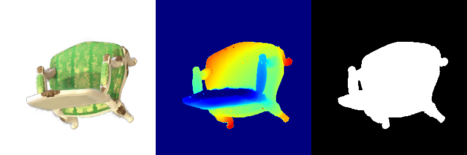
</p>

Do note that while the reference we have provided is a still frame, we expect you to submit the GIF that is output by the rendering code.

**GPU Memory Usage**: This task (with default paramter settings) may use approximately 6GB GPU memory. You can decrease/increase GPU memory utilization for performance by using the `--gaussians_per_splat` argument.

> **Submission:** In your webpage, attach the **GIF** that you obtained by running `render.py`

## 6 Training 3D Gaussian Representations (15 points)

Now, we will use our 3D Gaussian rasterizer to train a 3D representation of a scene given posed multi-view data. 

More specifically, we will train a 3D representation of a toy truck given multi-view data and a point cloud. The folder `./data/truck` contains images, poses and a point cloud of a toy truck. The point cloud is used to initialize the means of the 3D Gaussians. 

In this section, for ease of implementation and because the scene is simple, we will perform training using **isotropic** Gaussians. Do recall that you had already implemented all the necessary functionality for this in the previous section! In the training code, we just simply set `isotropic` to True while initializing `Gaussians` so that we deal with isotropic Gaussians.

For all questions in this section, you will have to complete the code in `train.py`

### 6.1 Setting Up Parameters and Optimizer

First, we must make our 3D Gaussian parameters trainable. You can do this by setting `requires_grad` to True on all necessary parameters in the function `make_trainable` in `train.py` (you will have to implement this function). 

Next, you will have to setup the optimizer. It is recommended to provide different learning rates for each type of parameter (for example, it might be preferable to use a much smaller learning rate for the means as compared to opacities or colours). You can refer to pytorch documentation on how to set different learning rates for different sets of parameters. 

Your task is to complete the function `setup_optimizer` in `train.py` by passing all trainable parameters and setting appropriate learning rates. Feel free to experiment with different settings of learning rates.

### 6.2 Perform Forward Pass and Compute Loss

We are almost ready to start training. All that is left is to complete the function `run_training`. Here, you are required to call the relevant function to render the 3D Gaussians to predict an image rendering viewed from a given camera. Also, you are required to implement a loss function that compared the predicted image rendering to the ground truth image. Standard L1 loss should work fine for this question, but you are free to experiment with other loss functions as well.

Finally, we can now start training. You can do so by running `python train.py`. This script would save two GIFs (`part_6_training_progress.gif` and `part_6_training_final_renders.gif`).

For reference, here is one frame from the training progress GIF from our reference implementation. The top row displays renderings obtained from Gaussians that are being trained and the bottom row displayes the ground truth. The top row looks good in this reference because this frame is from near the end of the optimization procedure. You can expect the top row to look bad during the start of the optimization procedure.

<p align="center">
  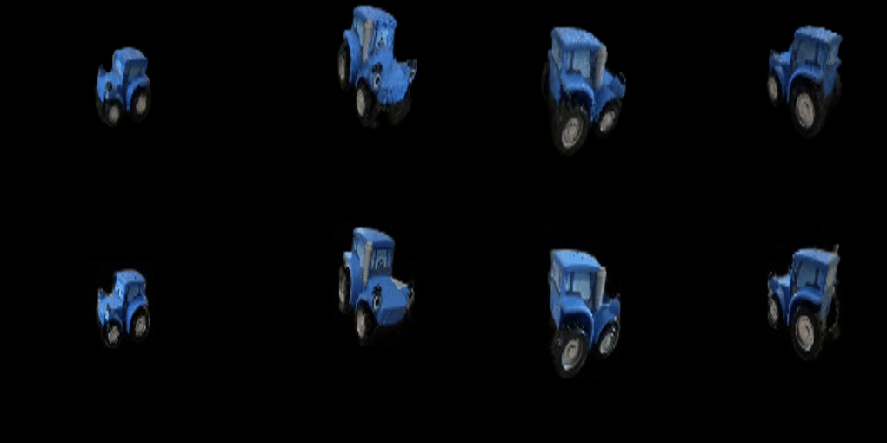
</p>

Also, for reference, here is one frame from the final rendering GIF created after training is complete

<p align="center">
  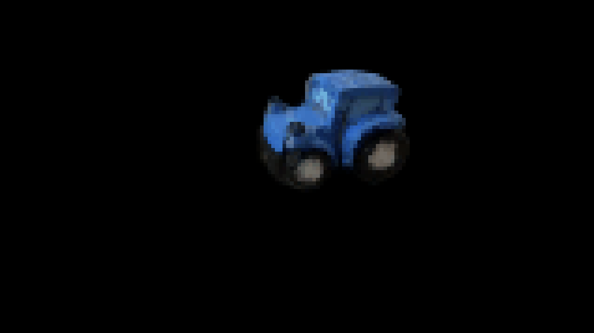
</p>

Do note that while the reference we have provided is a still frame, we expect you to submit the GIFs output by the rendering code. 

Feel free to experiment with different learning rate values and number of iterations. After training is completed, the script will save the trained gaussians and compute the PSNR and SSIM on some held out views. 

**GPU Memory Usage**: This task (with default paramter settings) may use approximately 15.5GB GPU memory. You can decrease/increase GPU memory utilization for performance by using the `--gaussians_per_splat` argument.

> **Submission:** In your webpage, include the following details:
> - Learning rates that you used for each parameter. If you had experimented with multiple sets of learning rates, just mention the set that obtains the best performance in the next question.
> - Number of iterations that you trained the model for.
> - The PSNR and SSIM.
> - Both the GIFs output by `train.py`.

## 7 Extensions **(Choose at least one! More than one is extra credit)**

### 7.1 Rendering Using Spherical Harmonics (10 points)

In the previous sections, we implemented a 3D Gaussian rasterizer that is view independent. However, scenes often contain elements whose apperance looks different when viewed from a different direction (for example, reflections on a shiny surface). To model these view dependent effects, the authors of the 3D Gaussian Splatting paper use spherical harmonics.

The 3D Gaussians trained using the original codebase often come with learnt spherical harmonics components as well. Infact, for the scene used in section 5. we do have access to the spherical harmonic components! For simplicity, we had extracted only the view independent part of the spherical harmonics (the 0th order coefficients) and returned that as colour. As a result, the renderings we obtained in the previous section can only represent view independent information, and might also have lesser visual quality.

In this section, we will explore rendering 3D Gaussians with associated spherical harmonic components. We will add support for spherical harmonics such that we can run inference on 3D Gaussians that are already pre-trained using the original repository (we will **not** focus on training spherical harmonic coefficients).

In this section, you will complete code in `model.py` and `data_utils.py` to enable the utilization of spherical harmonics. You will also have to modify parts of `model.py`. Please lookout for the tag `[Q 7.1]` in the code to find parts of the code that need to be modified and/or completed.

In particular, the function `colours_from_spherical_harmonics` requires you to compute colour given spherical harmonic components and directions. You can refer to function `get_color` in this [implementation](https://github.com/thomasantony/splat/blob/0d856a6accd60099dd9518a51b77a7bc9fd9ff6b/notes/00_Gaussian_Projection.ipynb) and create a vectorized version of the same for your implementation.

Once you have completed the above tasks, run `render.py` (use the same command that you used for question 5.5). This script will take a few minutes to render views of a scene represented by pre-trained 3D Gaussians.

For reference, here is one frame of the rendering obtained when we use all spherical harmonic components:

<p align="center">
  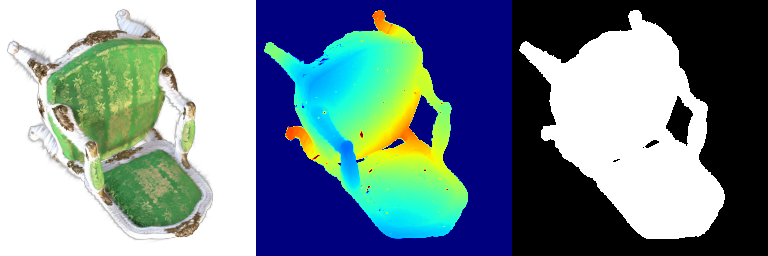
</p>

For comparison, here is one frame of the rendering obtained when we used only the DC spherical harmonic component (i.e., what we had done for question 5.5):

<p align="center">
  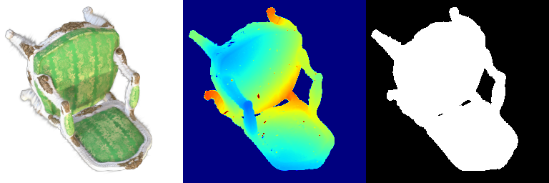
</p>

> **Submission:** In your webpage, include the following details:
> - Attach the GIF you obtained using `render.py` for questions 7.1 (this question) and 5.5 (older question).
> - Attach 2 or 3 side by side RGB image comparisons of the renderings obtained from both the cases. The images that are being compared should correspond to the same view/frame.
> - For each of the side by side comparisons that are attached, provide some explanation of differences (if any) that you notice.

### 7.2 Training On a Harder Scene (10 Points)

In question 6, we explored training 3D Gaussians to represent a scene. However, that scene is relatively simple. Furthermore, the Gaussians benefitted from being initialized using many high-quality noise free points (which we had already setup for you). Hence, we were able to get reasonably good performance by just using isotropic Gaussians and by adjusting the learning rate.

However, real scenes are much more complex. For instance, the scene may comprise of thin structures that might be hard to model using isotropic Gaussians. Furthermore, the points that are used to initialize the means of the 3D Gaussians might be noisy (since the points themselves might be estimated using algorithms that might produce noisy/incorrect predictions).

In this section, we will try training 3D Gaussians on harder data and initialization conditions. For this task, we will start with randomly initialized points for the 3D Gaussian means (which makes convergence hard). Also, we will use a scene that is more challenging than the toy truck data that you used for question 6. We will use the materials dataset from the NeRF synthetic dataset. While this dataset does not have thin structures, it has many objects in one scene. This makes convergence challenging due to the type of random intialization we do internally (we sample points from a single sphere centered at the origin). Download the materials dataset using the [Data setup instructions](#data), which places it in `GS/data/materials`.

You will have to complete the code in `train_harder_scene.py` for this question. You can start this question by reusing your solutions from question 6. But you may quickly realize that this may not give good results. Your task is to experiment with techniques to improve performance as much as possible.

Here are a few possible ideas to try and improve performance:
- You can start by experimenting with different learning rates and training for much longer duration.
- You can consider using learning rate scheduling strategies (and these can be different for each parameter).
- The original paper uses SSIM loss as well to encourage performance. You can consider using similar loss functions as well.
- The original paper uses adaptive density control to add or reduce Gaussians based on some conditions. You can experiment with a simplified variant of such schemes to improve performance.
- You can experiment with the initialization parameters in the `Gaussians` class.
- You can experiment with using anisotropic Gaussians instead of isotropic Gaussians. 

> **Submission:** In your webpage, include the following details:
> - Follow the submission instructions for question 6.2 for this question as well.
> - As a baseline, use the training setup that you used for question 6.2 (isotropic Gaussians, learning rates, loss etc.) for this dataset (make sure `Gaussians` have `init_type="random"`). Save the training progress GIF and PSNR, SSIM metrics.
> - Compare the training progress GIFs and PSNR, SSIM metrics for both the baseline and your improved approach on this new dataset.
> - For your best performing method, explain all the modifications that you made to your approach compared to question 1.2 to improve performance.

---
